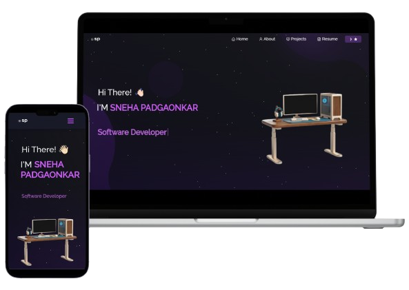

# My Portfolio

Welcome to my portfolio! I am a passionate **Third-year Computer Science student** at **Symbiosis Institute of Technology, Pune**, with a strong focus on **Web development** and **Data Science**. I love exploring new technologies, solving problems, and working on personal projects.

## About Me

I specialize in building responsive, user-friendly websites and web applications, as well as diving deep into the world of data science to analyze and solve complex problems. I am always eager to learn new skills and stay up-to-date with the latest trends in web development, data analysis, and machine learning.

- **Technologies I work with**: C,C++, Java, Python, HTML, CSS, JavaScript, MERN Stack, Machine Learning
- **Design Tools**: Figma, Adobe XD, Canva, etc.
- **Contact**: [padgaonkarsneha@gmail.com](mailto:padgaonkarsneha@gmail.com) | [LinkedIn Profile](https://www.linkedin.com/in/sneha-padgaonkar-59a098200/) | 
[Portfolio Website](https://snehasportfolio.vercel.app/)

---

This README showcases who I am, my skills, and how to get in touch with me. Feel free to explore my work, and don't hesitate to reach out!
